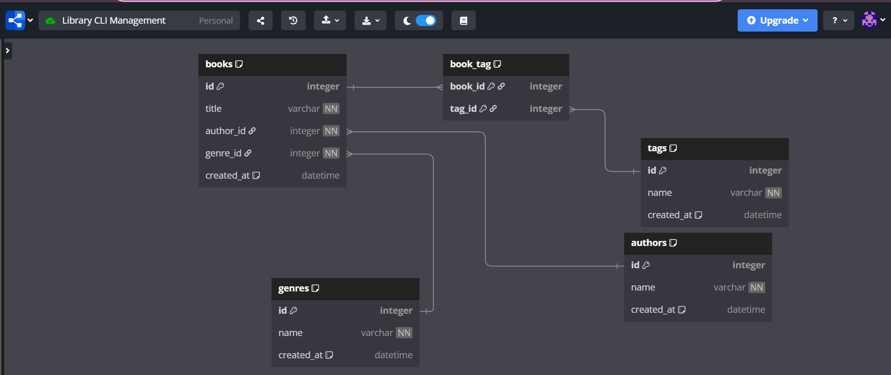

# 📚 Library CLI Manager

The **Library CLI Manager** is a fully modular Python command-line application designed to manage a digital library system. It supports full CRUD operations for **Authors**, **Books**, **Genres**, and **Tags**, using a clean architecture powered by **Click**, **SQLAlchemy**, and **Alembic**.

## 🚀 Features

- 🧠 Modular architecture (CLI, CRUD, Models separated cleanly)
- 🛠️ Full CRUD support for:
  - Authors
  - Books
  - Genres
  - Tags
- 🎨 Interactive terminal interface using click and a manual menu
- 💾 SQLAlchemy ORM for database modeling and querying
- 🔄 Alembic for smooth database migrations
- 🧪 Input validation and graceful error handling
- 🧹 Consistent formatting and user-friendly command output

## 🏁 Getting Started

### 1. Clone the Repo
### 2. pip install -r requirements.txt
### 3. alembic upgrade head
### 4. python main.py run [to run the program]